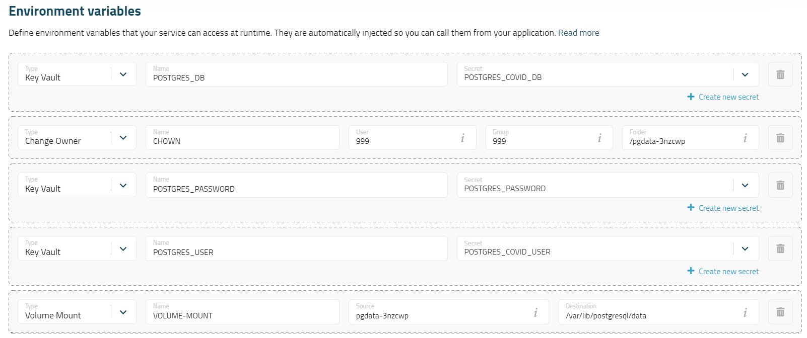
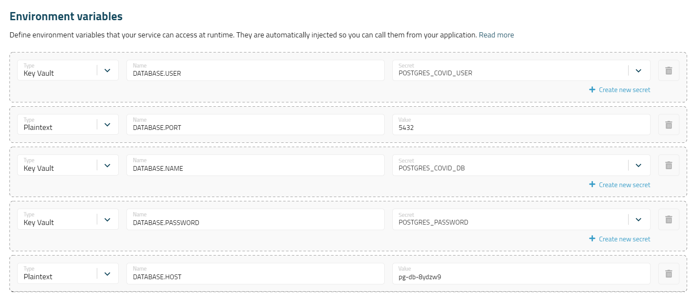
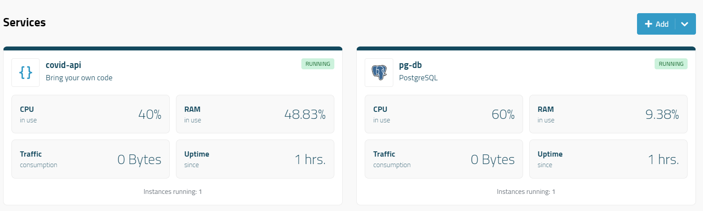

# TP Mise en Production - Prise en main de Mogenius

L'objectif de ce TP est de prendre en main Mogenius, un outil de gestion de configuration et de déploiement. Il permet de gérer les configurations de plusieurs conteneurs, de les déployer et de les mettre à jour.

## Mise en production d'une page web

La première étape est de mettre en production une page web. Pour cela, nous allons utiliser un conteneur Docker Nginx. Nous construisons un fichier Dockerfile qui permet de construire l'image Docker de notre conteneur.

```dockerfile
FROM nginx:1.23.2-alpine
COPY src/ /usr/share/nginx/html
```

Notre image se construit à partir d'une image Nginx avec un tag fixe. Le dossier `src`, contenant la page `index.html`, est copié dans le dossier de travail du conteneur.

Il est possible de déployer en local cette image en lançant la commande suivante :

```bash
docker build . -t nginx-server
```

Puis de lancer le conteneur avec la commande suivante :

```bash
docker run -d -p 8080:80 nginx-server
```

La page est alors accessible à l'adresse `http://localhost:8080`.

L'étape suivante est de déployer cette image grâce à Mogenius. Pour cela, nous allons créer un service "Bring your own code" dans Mogenius. Il suffit de renseigner le nom du service, le repository Github ainsi que la branche et le chemin vers le fichier Dockerfile. Le port n'est pas a renseigner car par défaut on utilise le port 80 au sein de Nginx.
Il suffit alors de cliquer sur "Create service" pour créer le service. Le build Docker va se lancer automatiquement et une fois terminé, le service sera déployé et accessible à l'adresse indiquée par Mogenius.

## Mise en production d'une application Spring Boot et sa base de données

### Base de données

La première étape est de mettre en production une base de données. Pour cela, nous allons utiliser un conteneur Docker Postgres. Nous utilisons un template fourni par Mogenius qui permet de construire le conteneur très rapidement.
Il suffit juste de renseigner le nom du service et les variables d'environnement.

Pour gérer les variables d'environnement, Mogenius fournit un `Key Vault`. Le `Key Vault` est plutôt destiné aux secrets mais nous allons également l'utiliser pour les variables d'environnement qui seront redondantes entre les différents services.
Trois variables sont donc présentes dans le `Key Vault`: `POSTGRES_COVID_USER`, `POSTGRES_PASSWORD` et `POSTGRES_COVID_DB`. Ces variables sont utilisées dans le template pour créer la base de données.



Il faut également veiller à ne pas exposer le service à l'extérieur.

Une fois toutes les informations entrées, il suffit de cliquer sur "Create service" et attendre que le service soit déployé.

### Application Spring Boot

La seconde étape est de mettre en production une application Spring Boot. Pour cela, nous allons utiliser notre propre Dockerfile

```dockerfile
FROM gradle:7.5.1-jdk17-alpine AS build
COPY --chown=gradle:gradle . /home/gradle/src
WORKDIR /home/gradle/src
RUN gradle build --no-daemon

FROM openjdk:17-slim

EXPOSE 8080

RUN mkdir /app

COPY --from=build /home/gradle/src/build/libs/covid-api-0.0.1-SNAPSHOT.jar /app/covid-api.jar

ENTRYPOINT ["java", "-XX:+UnlockExperimentalVMOptions", "-Djava.security.egd=file:/dev/./urandom","-jar","/app/covid-api.jar"]
```

Dans l'interface de Mogenius, il suffit de renseigner le nom du service, le repository Github ainsi que la branche et le chemin vers le fichier Dockerfile. Il faut également renseigner le port `8080` car c'est le port exposé pour Spring Boot.
Concernant les variables d'environnement, on peut réutiliser les variables du `Key Vault` créées précédemment. Il faut également ajouter la variable `DATABASE.HOST`, sa valeur est l'adresse d'exposition interne du service Postgres créé précédemment.



Pour finir, nous créons le service et attendons le déploiement. Le service est alors accessible à l'adresse indiquée par Mogenius.

## Conclusion

Pour conclure, on obtient un service Spring Boot déployé et accessible depuis l'exterieur, couplé à une base de données PostgreSQL. Pour d'eventuelles mise à jour du code source, il suffira de build une nouvelle fois l'image Spring Boot.


